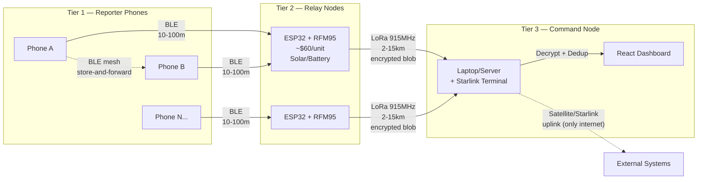
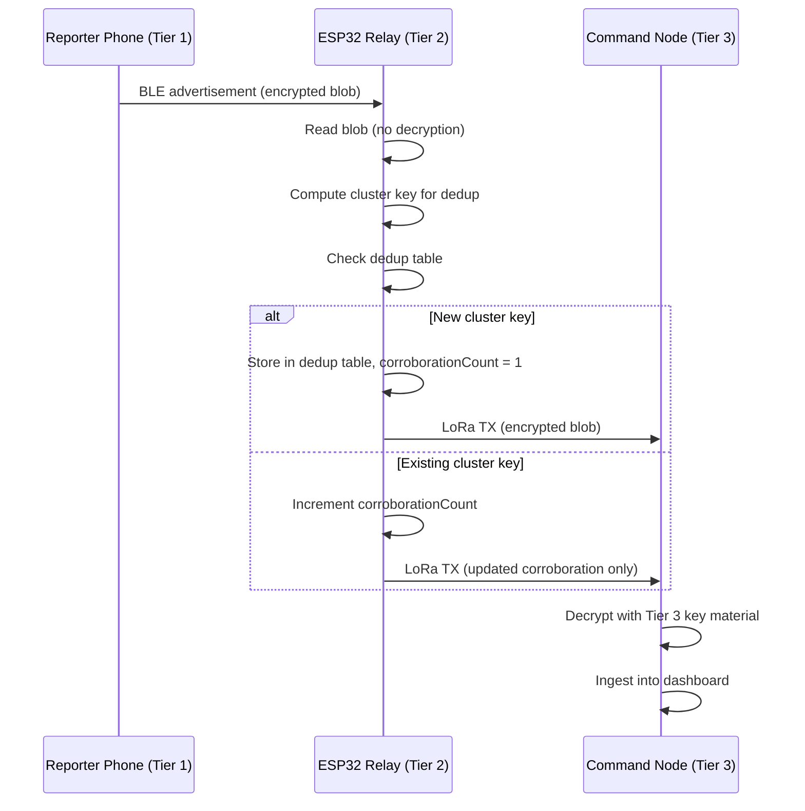
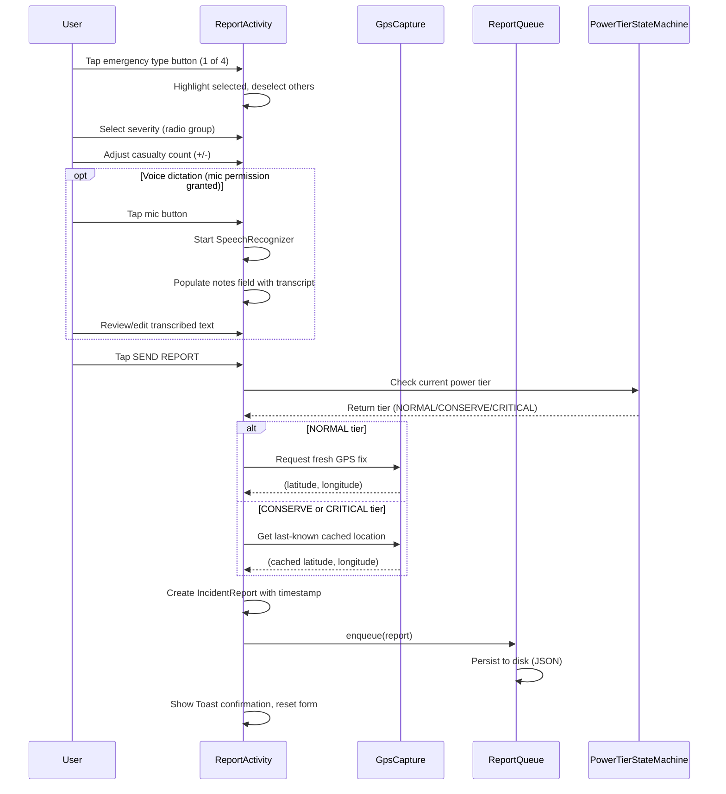
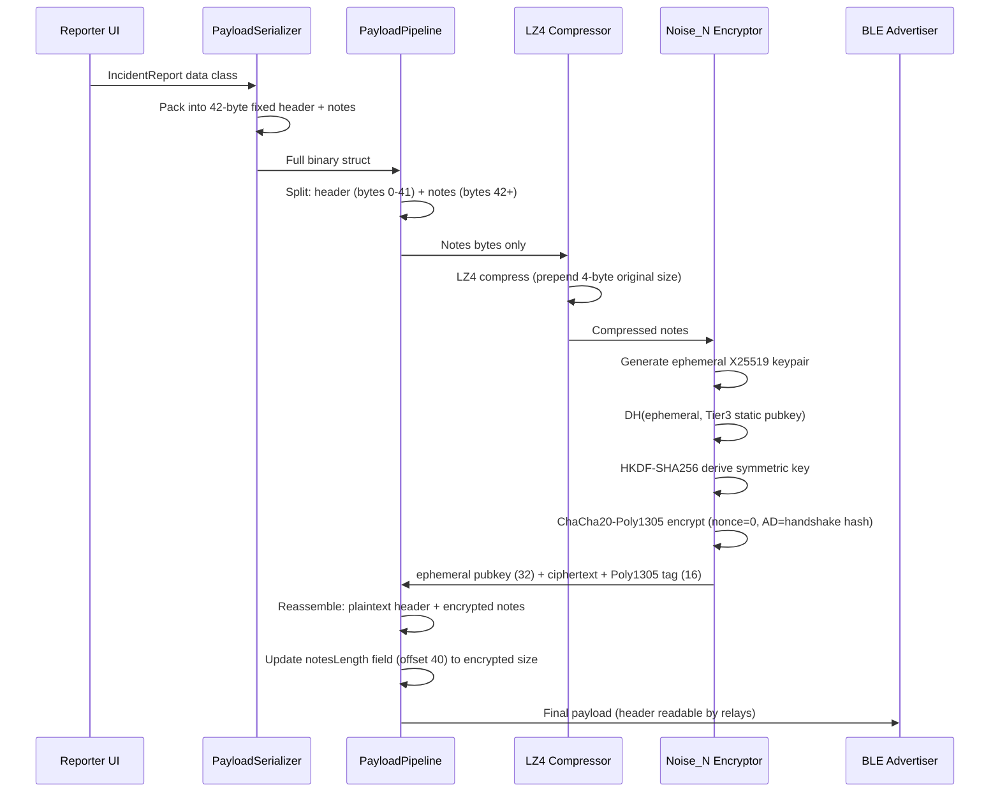
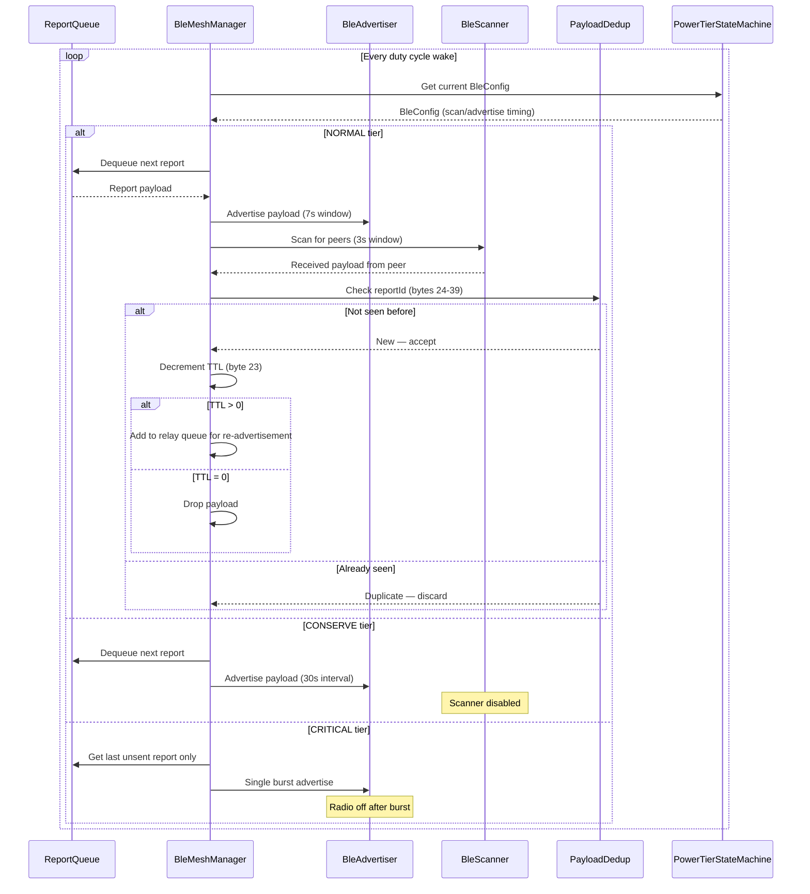

# Wiring & Systems Diagrams

## System-Level Architecture



## Power-Tier State Machine (Phone-Side)

```mermaid
stateDiagram-v2
    [*] --> NORMAL

    NORMAL --> CONSERVE : battery <= 40%
    CONSERVE --> NORMAL : battery > 40%
    CONSERVE --> CRITICAL : battery <= 15%
    CRITICAL --> CONSERVE : battery > 15%

    state NORMAL {
        note right of NORMAL
            Battery > 40%
            BLE: 3s scan / 7s advertise duty cycle
            GPS: on-demand (fresh fix per report)
        end note
    }

    state CONSERVE {
        note right of CONSERVE
            Battery 15–40%
            BLE: advertise-only every 30s (no scanning)
            GPS: last-known-cached (no new fixes)
        end note
    }

    state CRITICAL {
        note right of CRITICAL
            Battery < 15%
            BLE: single advertise burst every 5 min
            Payload: last unsent report only
            Then radio off, screen stays locked
        end note
    }
```

## Phase 0 Sequence — Relay Forwarding (BLE → LoRa)



## Phase 1 Sequence — Report Creation (on Reporter Phone)




## Phase 2 Sequence — Payload Pipeline (on Reporter Phone)



## Phase 3 Sequence — BLE Mesh Transport (Phone ↔ Phone ↔ Relay)



## Wire Format Table (Source of Truth)

This table defines the binary struct layout for the incident report payload
**before** compression and encryption. Any change to this table must be
reflected in the serialization code in the same commit.

| Byte Offset | Field             | Width (bytes) | Type / Encoding                          |
|-------------|-------------------|---------------|------------------------------------------|
| 0           | version           | 1             | uint8 — protocol version (currently `1`) |
| 1           | emergencyType     | 1             | uint8 enum: 0=Trapped, 1=Injured, 2=Fire, 3=NeedEvac |
| 2           | severity          | 1             | uint8 enum: 0=Low, 1=Medium, 2=High, 3=Critical |
| 3           | casualtyCount     | 2             | uint16 LE                                |
| 5           | timestamp         | 8             | int64 LE — Unix epoch millis             |
| 13          | latitude          | 4             | float32 LE (IEEE 754)                    |
| 17          | longitude         | 4             | float32 LE (IEEE 754)                    |
| 21          | corroborationCount| 2             | uint16 LE — set/incremented by relay     |
| 23          | ttl               | 1             | uint8 — hop count, decremented per relay |
| 24          | reportId          | 16            | UUID v4, 128-bit, big-endian             |
| 40          | notesLength       | 2             | uint16 LE — byte length of notes field   |
| 42          | notes             | 0–256         | UTF-8 string, max 256 bytes              |

**Total fixed header:** 42 bytes. **Max payload (with notes):** 298 bytes.

**Security Split (Implementation Detail):** The first 42 bytes (the fixed header) are
transmitted in plaintext so that relays can read dedup fields (like `reportId`) and
mutate routing fields (like `ttl` and `corroborationCount`) without holding decryption
keys. Only the `notes` field (bytes 42+) is compressed with LZ4 and encrypted.

**Encrypted Notes Blob Format (Noise_N_25519_ChaChaPoly_SHA256):**

| Offset within blob | Field              | Width (bytes) | Description                                       |
|--------------------|--------------------|---------------|---------------------------------------------------|
| 0                  | ephemeral pubkey   | 32            | X25519 ephemeral public key (unique per message)  |
| 32                 | ciphertext         | variable      | ChaCha20-Poly1305 encrypted (LZ4-compressed notes)|
| 32 + ct_len        | auth tag           | 16            | Poly1305 authentication tag                       |

The `notesLength` field at header offset 40 stores the total length of this encrypted
blob (32 + ciphertext_len + 16). Tier 3 uses its static X25519 private key to perform
DH with the ephemeral public key, derive the symmetric key via HKDF-SHA256, and
decrypt. Extracting the embedded public key from the APK gives zero decryption
capability because the key relationship is asymmetric.

After LZ4 compression and Noise_N encryption, expect ~320–370 bytes worst case
for a full payload (20 bytes more than the previous AES-GCM stub due to the 32-byte
ephemeral key replacing the 12-byte nonce) — still within BLE extended advertisement
and LoRa packet limits.
